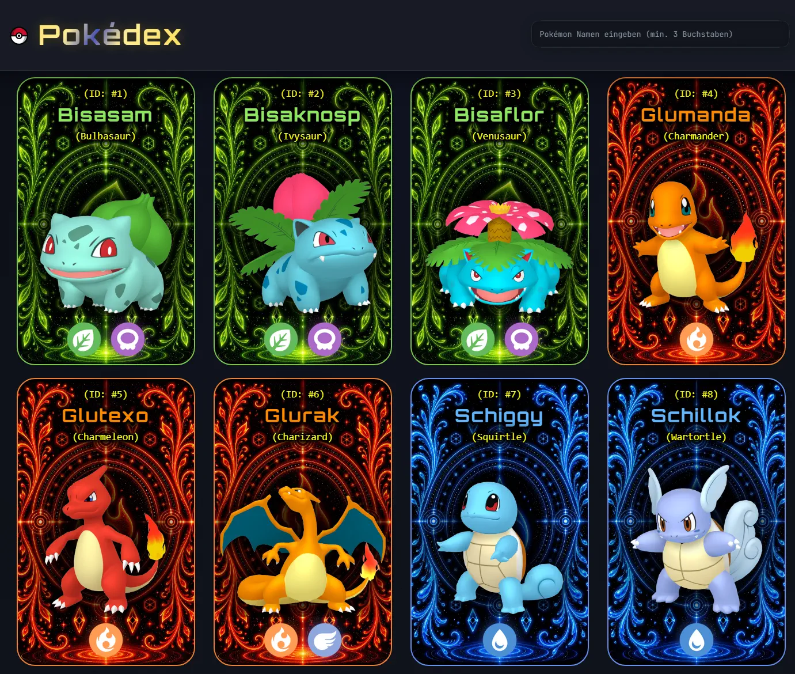
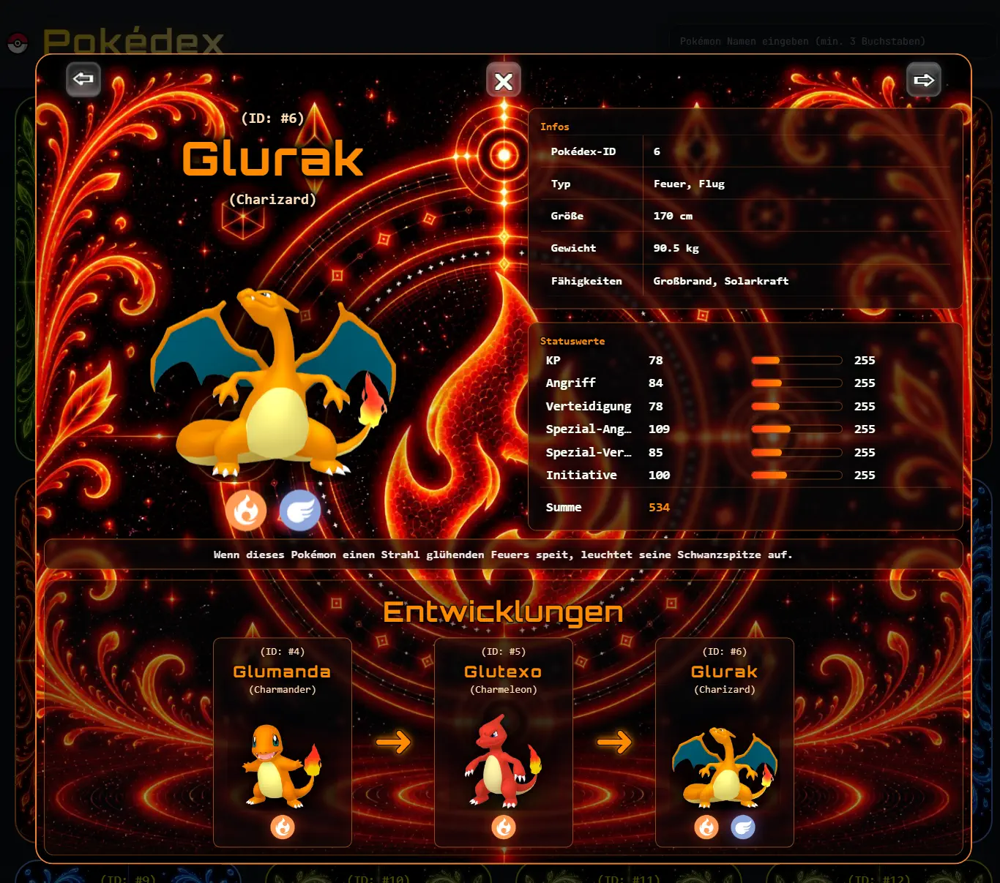

# Pokédex

A responsive Pokédex web application built with Vanilla JavaScript that fetches Pokémon data from the PokéAPI and displays it in an interactive user interface.

This project was created as a mandatory assignment during the Frontend Development course at Developer Akademie. The focus of this module was learning how to work with APIs, asynchronous JavaScript, and dynamic content rendering.

## Features

* Display Pokémon data fetched from the PokéAPI
* Search Pokémon by name
* Interactive Pokémon detail dialog
* Dynamic rendering of API data
* Responsive design for desktop and mobile devices
* Clean and user-friendly interface

## Screenshots

### Pokémon Overview

Main application view displaying Pokémon cards loaded from the API.



### Pokémon Details

Detailed Pokémon information displayed in an interactive dialog.



## Technologies Used

* HTML5
* CSS3
* JavaScript (ES6+)
* REST APIs
* PokéAPI

## Learning Objectives

This project focuses on:

* Working with external APIs
* Fetching and processing JSON data
* Asynchronous JavaScript using async/await
* Dynamic DOM manipulation
* Responsive web design
* Component-based UI thinking

## Getting Started

### Clone the repository

```bash
git clone https://github.com/your-username/pokedex.git
```

### Open the project

Simply open the `index.html` file in your browser or use a local development server.

## Project Structure

```text
├── assets/
├── css/
├── js/
├── subpages/
├── index.html
├── README.md
├── script.js
└── style.css
```

## About Me

I am currently enrolled in the Fullstack Developer and DevSecOps program at Developer Akademie. My focus is on building modern web applications while continuously expanding my knowledge in backend development, security, and software engineering best practices.

## Author

Sascha Schmitt

## License

This project was created for educational purposes as part of the Developer Akademie curriculum.
